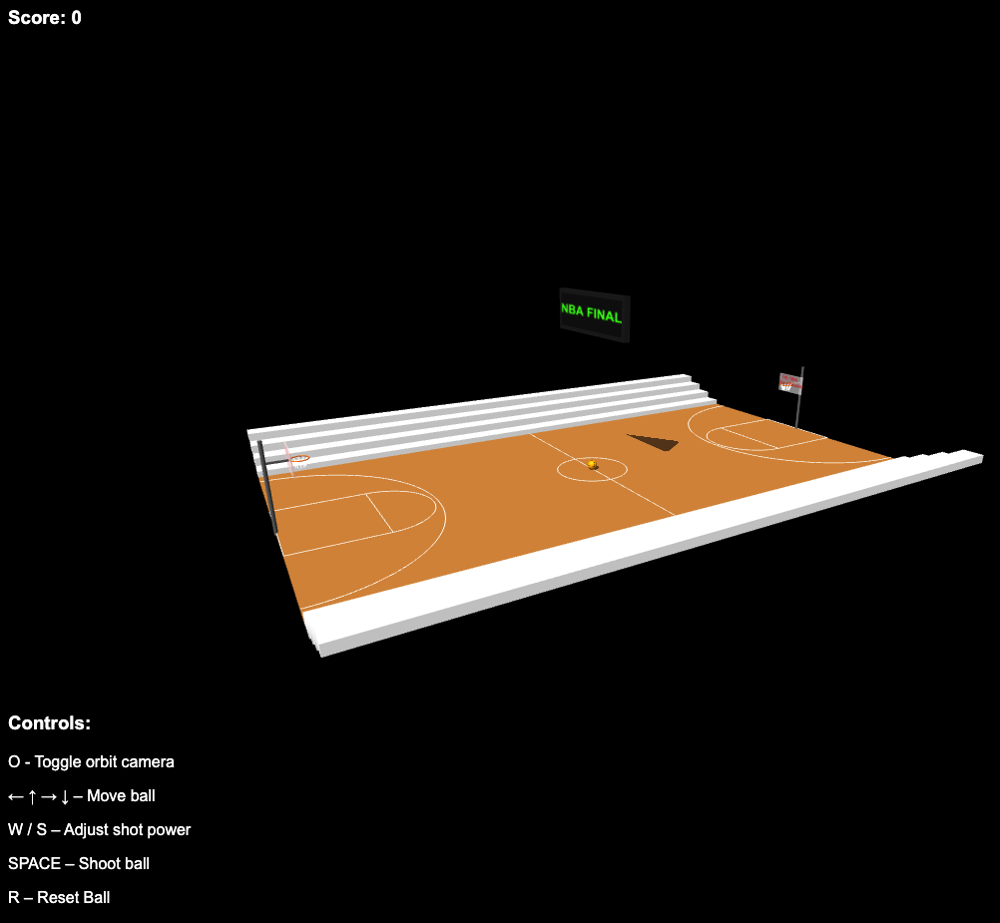
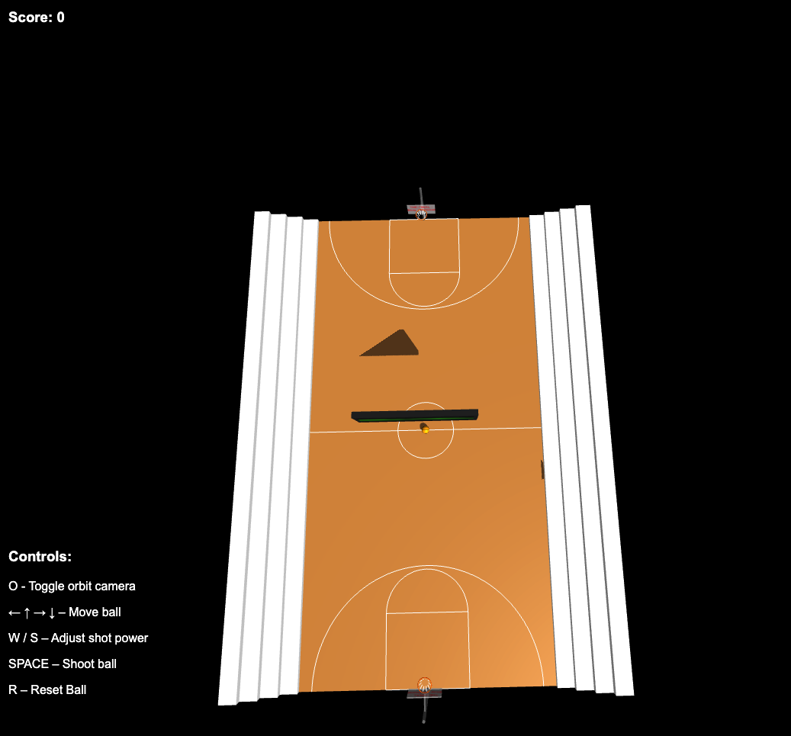
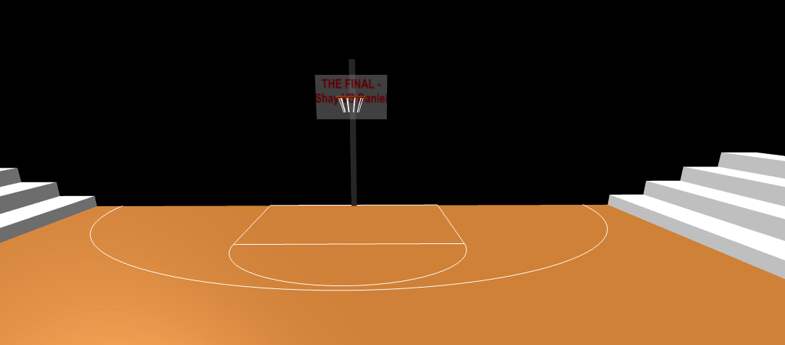
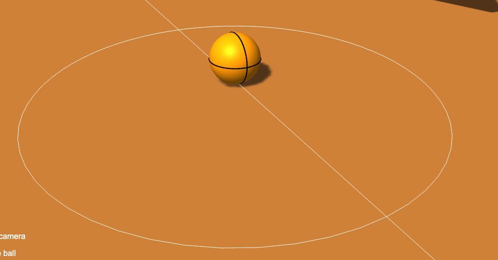

# Computer Graphics - Exercise 5 - WebGL Basketball Court

## Complete Instructions
**All detailed instructions, requirements, and specifications can be found in:**
`basketball_exercise_instructions.html`

## Group Members
- Shay Grinfeld
- Daniel Katz

## Technical Details
- Run the server with: `node index.js`
- Access at http://localhost:8000 in your web browser

## Additional Implemented Features
- More detailed court markings
- More detailed hoop models -branded backboards
- Stadium environment - bleachers
- Stadium environment - final banner

## Screenshots Of The Implementation

