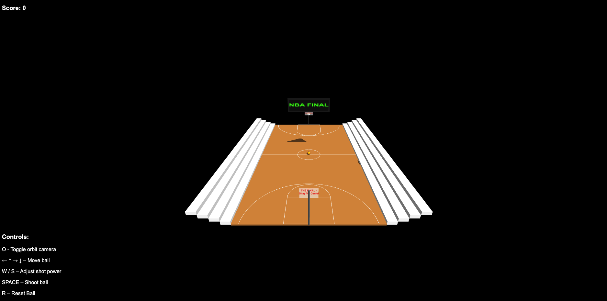
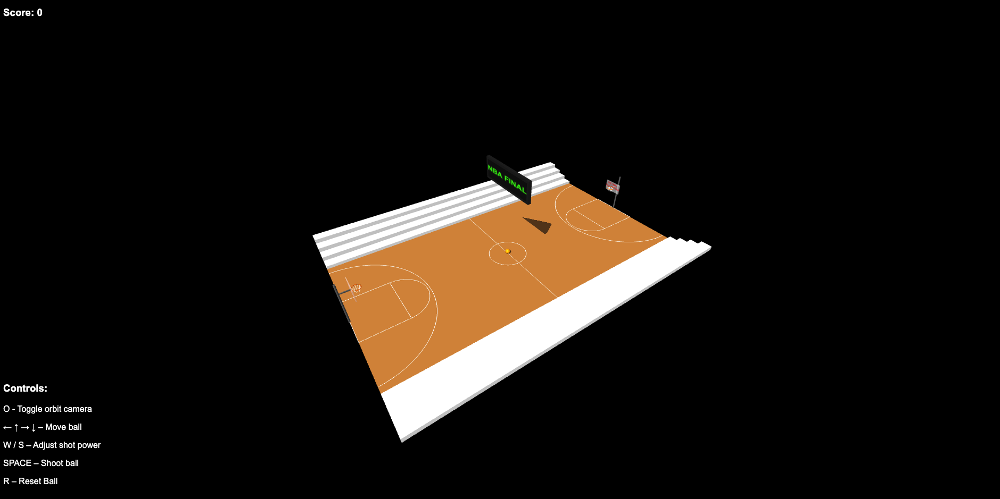
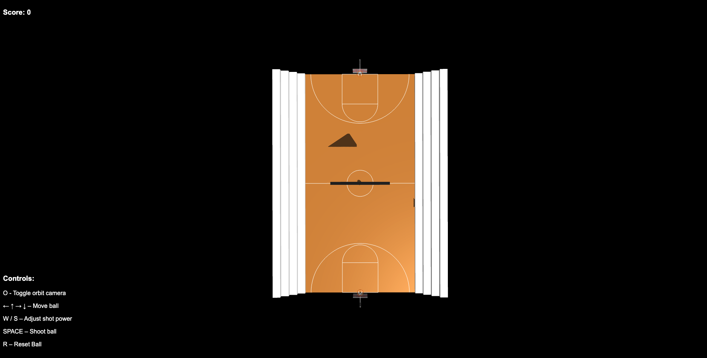
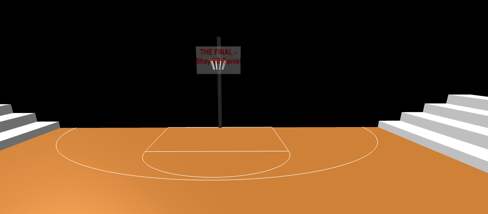
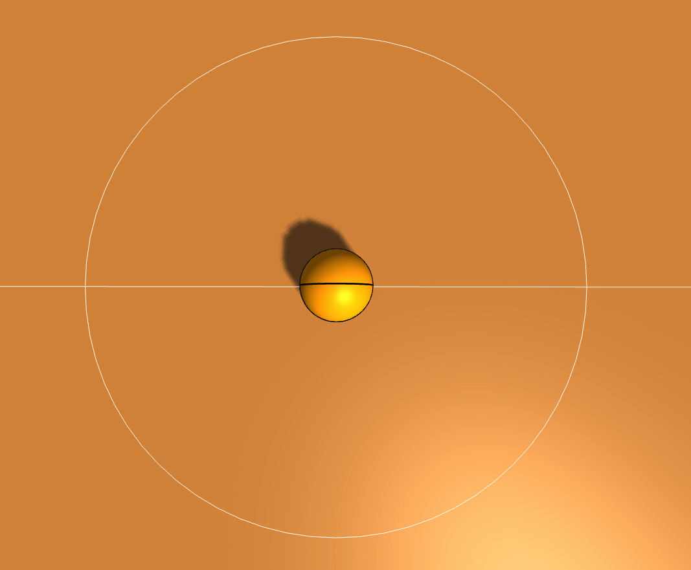
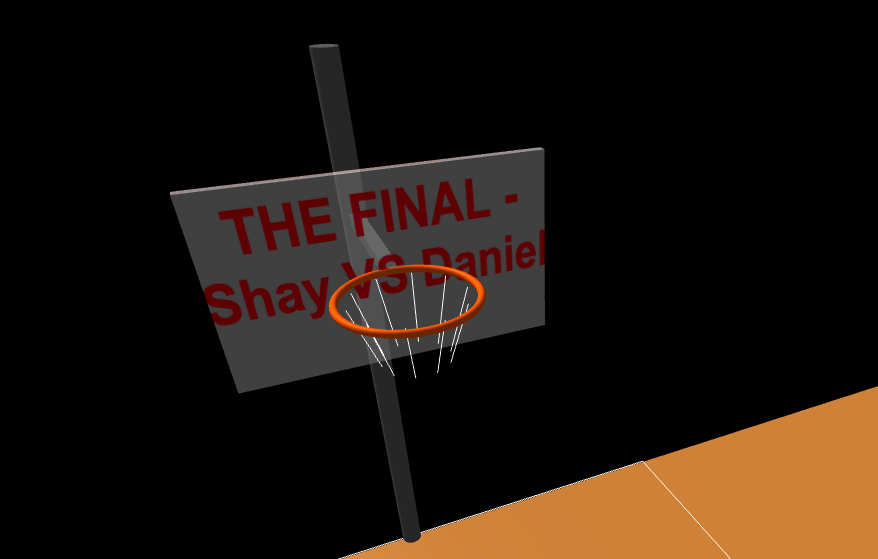

# Computer Graphics - Exercise 6 - WebGL Basketball Court

## Complete Instructions
**All detailed instructions, requirements, and specifications can be found in:**
- `basketball_exercise_instructions.html`
- `basketball_exercise_hw06_instructions.html`

## Group Members
- Shay Grinfeld
- Daniel Katz

## Technical Details
- Run the server with: `node index.js`
- Access at http://localhost:8000 in your web browser

# Exercise 6
## Controls
- O | Toggle orbit camera controls
- ← ↑ → ↓ |	Move ball around court (X/Z axes)
- W / S | Increase / decrease shot power (0–100%)
- SPACE | 	Launch basketball toward hoop
- R | 	Reset ball to center with default power

## Physics System Implementation
### Gravity & Trajectory
Constant downward acceleration (–9.8 m/s²), resulting in a parabolic flight path.

### Shot Mechanics
Initial velocity is computed from the ball’s position relative to the hoop plus a small upward “arc” boost, then scaled by the current shot power.

### Collision Detection
- Ball–ground: bounce with coefficient of restitution (0.7) until it comes to rest.
- Backboard: reflect Z-velocity upon impact near rim height.
- Rim scoring: detect when the ball passes through the rim plane within a given horizontal radius; award 2 points once per shot.

### Rotation Animation
Spin axis = cross(velocity, up), speed ∝ |velocity|/radius, applied each frame for a realistic rolling effect.

## Additional Features
- 3D bleachers and stadium banner for ambiance
- Canvas‑rendered backboard text (THE FINAL – Shay VS Daniel)
- Court line geometry: center circle, 3‑pt arcs, free‑throw lanes
- On‑screen UI overlay: live score, shot power, attempts, makes, accuracy, control hints, and feedback messages
- Fully decoupled post‑make spin so the ball continues rotating after scoring

## Known Issues & Limitations
- Ball may clip slightly on very high‑speed bounces
- No physical rim‑ring bounce (pass‑through only)
- Camera can sometimes clip through the court edges at extreme angles
- Statistics UI doesn’t persist between page reloads

## Screenshots 

# Exercise 5
## Additional Implemented Features
- More detailed court markings
- More detailed hoop models -branded backboards
- Stadium environment - bleachers
- Stadium environment - final banner

## Screenshots Of The Implementation

